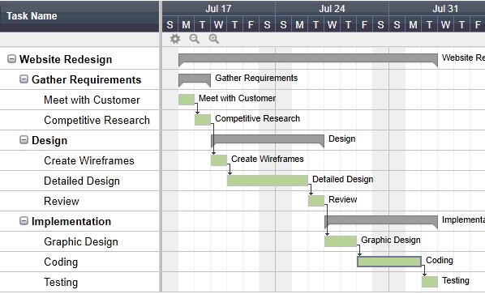
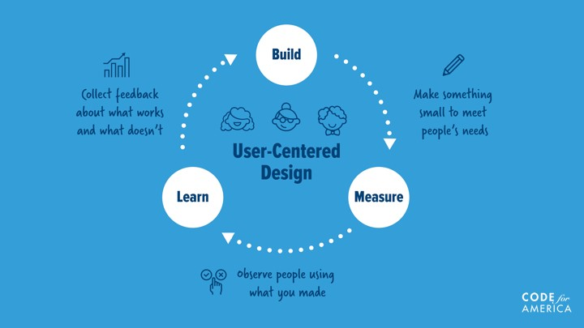

# Systems Development Lifecycle (SDLC)

The **Systems Development Lifecycle (SDLC)** refers to an end-to-end process by which systems are built and managed. Common approaches include "Traditional", "Agile", and everything in-between.

## Methodologies

### Traditional

A traditional, or "waterfall" approach involves gathering system requirements up-front, and then moving through various discrete phases of effort once in chronological order, with the next phase not beginning before the previous phase ends, and the lifecycle ending after the last phase is complete.

order | phase | description
--- | --- | --
1 | **Planning** / **Ideation** | Gathering requirements, discovering user needs, and brainstorming potential solutions. Includes setting system objectives and hypotheses.
2 | **Analysis** / **Investigation** | Determining the feasibility of certain potential solutions and choosing one to implement.
3 | **Design** | Translating requirements into technical specifications to guide and inform development efforts.
4 | **Implementation** | Developing the system, including writing code, deploying servers, and delivering the finished product.
5 | **Maintenance** | Monitoring system operations and fixing bugs as necessary.

See also: http://www.umsl.edu/~hugheyd/is6840/waterfall.html

### Agile

> Agile is an iterative approach to project management and software development that helps teams deliver value to their customers faster and with fewer headaches. Instead of betting everything on a "big bang" launch, an agile team delivers work in small, but consumable, increments. Requirements, plans, and results are evaluated continuously so teams have a natural mechanism for responding to change quickly. - [Atlassian Agile Coach](https://www.atlassian.com/agile)

The [Agile Manifesto](http://agilemanifesto.org/) describes an official set of principles which comprise the "Agile" approach. Among them are:

  + *"[The] highest priority is to satisfy the customer
through early and continuous delivery
of valuable software"*
  + *"The sponsors, developers, and users should be able
to maintain a constant pace indefinitely."*
  + *"At regular intervals, the team reflects on how
to become more effective, then tunes and adjusts
its behavior accordingly."*

> Agile isn't defined by a set of ceremonies or specific development techniques. Rather, agile is a group of methodologies that demonstrate a commitment to tight feedback cycles and continuous improvement. - [Atlassian Agile Coach](https://www.atlassian.com/agile)

phase | description
--- | --
**Build** | Developing the system, including writing code, deploying servers, and delivering the finished product.
**Measure** | Gathering qualitative and/or quantitative data to track the system's ability to satisfy certain objectives.
**Learn** | Synthesizing success metrics into lessons learned, gathering additional requirements, setting updated system objectives and hypotheses, and deciding what to build next.

## Choosing a Methodology

If you have a well-defined problem, a clear set of requirements, and your team has experience building similar systems in the past, then a waterfall approach may be the most efficient choice. It will allow your team to deliver the final product more quickly.

However, if the problem is not well defined, or the system requirements are not entirely clear, or your team doesn't have previous experience building similar systems, then an agile approach may be the best choice. It will allow your team to be flexible to changing requirements and deliver a minimum viable product more quickly.
