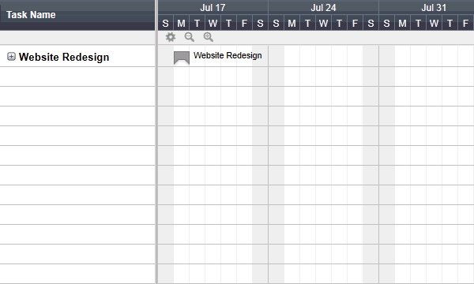

# Management of Systems Development

Management Tools:

  + Trello
  + Jira
  + Asana
  + GitHub Projects

## Gantt Charts

A **Gantt Chart** helps project managers plan project efforts over time, specifically identifying any dependencies that exist between sub-processes, or "tasks".

Each task is generally associated with a length of time, and perhaps dates denoting when that sub-process are supposed to begin and end.

Gantt charts help identify a project's "critical path", or the ordering of activities which leads to the minimum time for the project to be completed.

## Kanban Boards

> Kanban is a popular framework used to implement agile software development. It requires real-time communication of capacity and full transparency of work. Work items are represented visually on a kanban board, allowing team members to see the state of every piece of work at any time. - [Atlassian Agile Coach](https://www.atlassian.com/agile/kanban)
