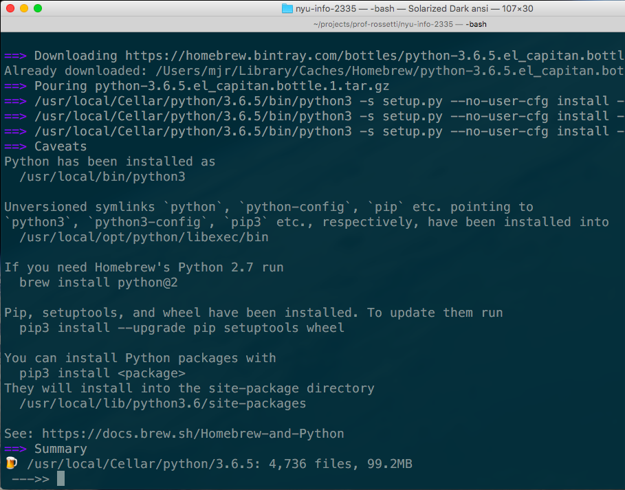

# Installing Python on Mac OS

You may download Python 3.6.x from the [Python website](https://www.python.org/downloads/), but you are instead encouraged to use the [Homebrew](https://brew.sh/) package manager to install it. Homebrew is "the way" developers install programs on a Mac.

## Detecting and Installing Homebrew

Check to see if Homebrew is installed:

```sh
which brew
```

Install Homebrew if necessary:

```sh
/usr/bin/ruby -e "$(curl -fsSL https://raw.githubusercontent.com/Homebrew/install/master/install)"
```

## Using Homebrew to Install Python

Detect if Python has already been installed by Homebrew:

```sh
brew list #> includes "python" or doesn't
brew list python #> lists installed files or produces an error
```

[Use Homebrew to install Python 3.6.x](http://docs.brew.sh/Homebrew-and-Python.html) as necessary:

```sh
brew install python
```




> NOTE: for those students who installed Python on a Mac via Homebrew, when you see future references to running `python` or `pip`, you should instead be running `python3` or `pip3`.
