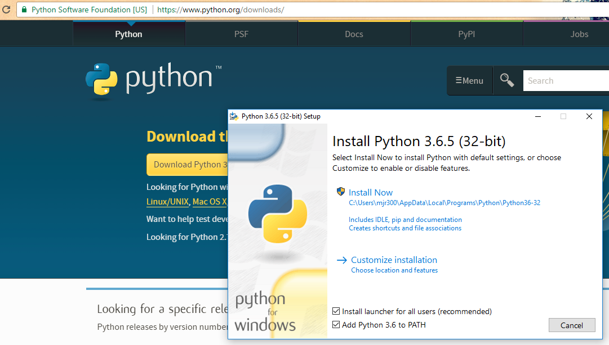

# Installing Python on Windows OS

Download Python 3.6.x from the [Python website](https://www.python.org/downloads/) and run the installer.

> NOTE: make sure to check the installation option "Add Python 3.6 to PATH" 
