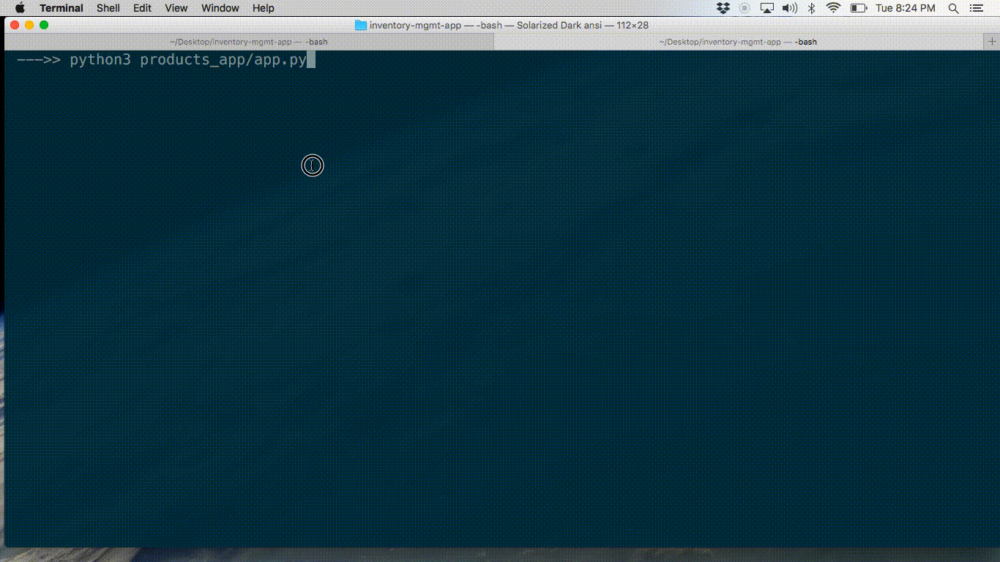
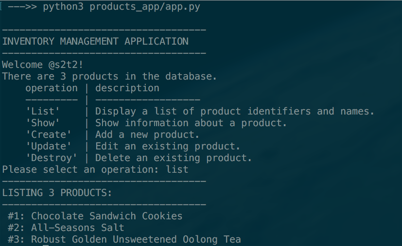
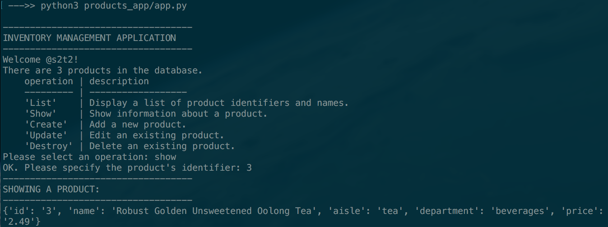
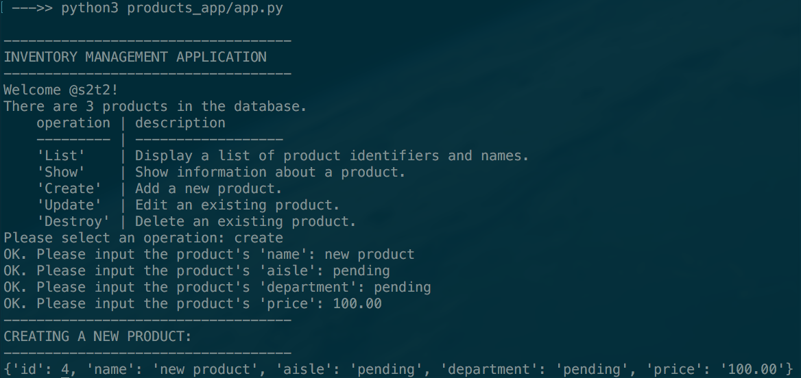
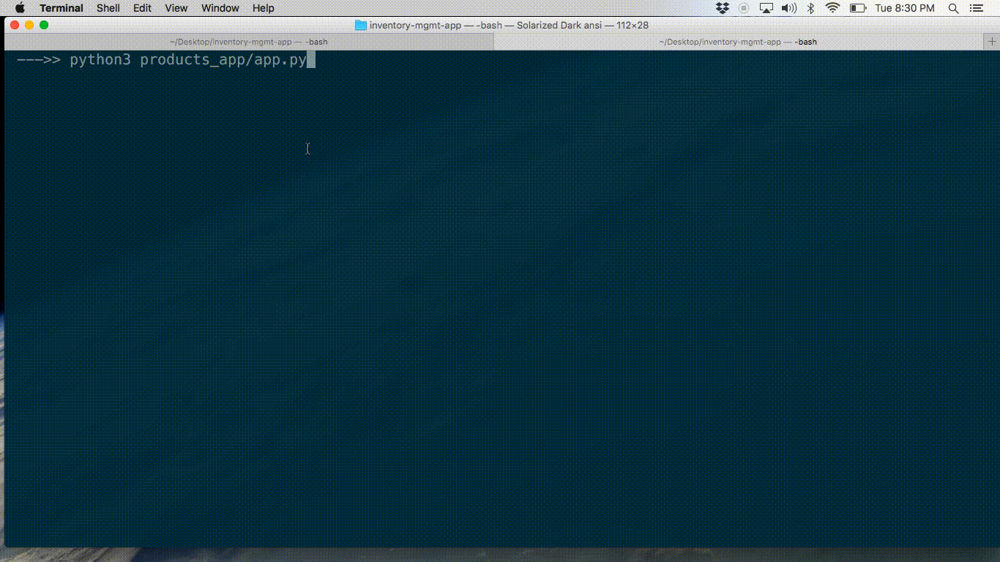
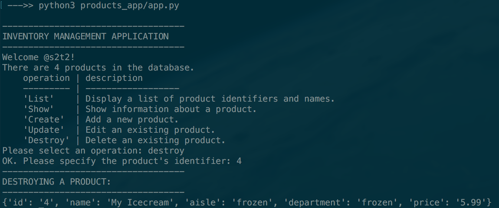

# Inventory Management App

Your local corner grocery store has hired you to help them modernize their checkout system.

After delivering an awesome Point-of-Sale Application,
the store owner now asks you to create an application
which will help store managers keep track of their inventory of products.
The store owner would like to use the application at each of a small handful of store locations,
each of which has its own inventory.

Write a Python program to perform CRUD operations on an inventory of products kept in a CSV file.

> NOTE: CRUD is an acronym for "Create", "Read", "Update", and "Destroy". These operations represent the primary actions performed on database resources (i.e. records) within an information system. The "Read" operation comprises two operations: the "List" operation for reading all records, as well as the "Show" operation for reading a single record.

List Products:

Show Product:

Create Product:

Update Product:

Destroy Product:

> NOTE: Don't be constrained by the images above. Feel free to create your own user interface and experiences.

## Requirements

Your program should meet all the requirements set forth in the sections below.

If you need help or inspiration, see the [Checkpoints](checkpoints.md) document for a step-by-step guided walk-through,
or try using this [Starter App](https://github.com/prof-rossetti/inventory-mgmt-app-py) as a foundation to build upon.

If you are moving through this project with ease,
consider addressing one or more of the [Further Exploration](further.md) challenges,
but only after you have finished the core required functionality.

### Repository Requirements

The program's source code should be hosted on GitHub.com in its own dedicated repository which includes at least the following files:

  + A Markdown file located at `README.md`, which describes how to install and use the program.
  + A Python file located at `products_app/app.py`, which includes your application code.
  + A CSV file located at `products_app/db/products_default.csv`, which should be a copy of [this default products file](https://raw.githubusercontent.com/prof-rossetti/nyu-info-2335-201805/master/projects/inventory-app/data/products_default.csv).

### CSV Datastore Requirements

The program should interface with an inventory of products kept in a CSV file located at `products_app/db/products.csv`,
however this CSV file should not be tracked in version control or included in your GitHub repository. HINT: you may need to use a [local `.gitignore` file](https://help.github.com/articles/ignoring-files/#create-a-local-gitignore), or just don't upload the CSV file to GitHub.

The program should assume existence of this CSV file in the specified location.
And it should assume the CSV file contains the proper header row:

    id,name,aisle,department,price

The program should function even if the CSV file contains no additional rows besides the header row.
This would correspond to a situation where there are no products in the inventory.

The program should function regardless of the order of the rows in the CSV file.

### Interface Requirements

The program should display a user interface which contains:

  + A friendly greeting message including a user name of choice.
  + The number of products currently in inventory.
  + A list of all available operations (e.g. "List", "Show", "Create", "Update", "Destroy", and maybe "Reset") and instructions for how to select one.

### Functionality Requirements

The program should prompt the user to select one operation at a time
(e.g. "List", "Show", "Create", "Update", "Destroy", and maybe "Reset").
If an unrecognized operation is selected,
the program should fail gracefully by displaying an "Unrecognized Operation" message to the user.
Otherwise it should perform the selected operation in accordance with the following expectations,
prompting the user for additional inputs as necessary:

  + The **List** operation should print information (identifiers and names at least) about each product in the inventory.
  + The **Show** operation should prompt the user for a product identifier. If the product identifier matches the identifier of an existing product in the inventory, the program should print all available information about that product.
  + The **Create** operation should prompt the user to input a new product's `"name"`, `"department"`, `"aisle"` and `"price"`, and should automatically determine the new product's `"id"` by adding 1 to the greatest identifier currently in the inventory. Then the program should save the new product's information by adding a new row at the bottom of the CSV file.
  + The **Update** operation should prompt the user for a product identifier. If the product identifier matches the identifier of an existing product in the inventory, the program should prompt the user to input new values for that product's `"name"`, `"department"`, `"aisle"` and `"price"` attributes, and overwrite that product's corresponding row in the CSV file.
  + The **Destroy** operation should prompt the user for a product identifier. If the product identifier matches the identifier of an existing product in the inventory, the program should display a helpful message and remove that product's corresponding row from the CSV file.

The "Show", "Update", and "Destroy" operations should each fail gracefully (i.e. display a friendly "Product Not Found" message) if no product matches the specified identifier.

Additionally, the program should have a way of automatically overwriting
the contents of the `products_app/db/products.csv` file with
the contents of the `products_app/db/products_default.csv` file.
One way to do this would be to allow the user to enter an operation called **Reset**.

## Submission Instructions

By this time, students should be able to replicate the submission instructions from previous deliverables, also abbreviated below.

### Step 1 - Creating a new Project Repo

Either "fork" the [Starter App](https://github.com/prof-rossetti/inventory-mgmt-app-py) and build on-top of it, or create your own repository from scratch.

If creating a repository from scratch,
use the GitHub.com online interface to create a new GitHub repository under your control
named something like "inventory-mgmt-app".
When you create the new repository, in order to easily use the GitHub.com online interface to manage files,
check the box to **Initialize this repository with a README**.
Once the repository is created, add all the necessary files (e.g. `products_app/app.py`, `products_app/db/products_default.csv`, etc.), and commit them.
At this time you should be able to view your files online at your project repository's URL.

### Step 2 - Forking the Course Repo

If you have not yet already forked the course repository, do so now.

Otherwise, if you have already forked the course repository
(i.e. if you have already submitted a previous exercise),
then you will need to update your existing fork instead.

### Step 3 - Submitting a Pull Request

Add a new record to the [submissions file](submissions.csv),
to include your GitHub username and the repository's URL (e.g. `https://github.com/YOUR_USERNAME/inventory-mgmt-app`).
After updating your own fork, you will need to submit a Pull Request
for your content to be accepted into the main course repository. Before you update your fork, make sure you don't have any outstanding [pull requests](https://github.com/prof-rossetti/nyu-info-2335-201805/pulls).

## Evaluation

Extra credit for presence of a Python program which runs without error,
satisfies all requirements,
and exactly produces the desired functionality,
in addition to the functionality described in the "further exploration" challenges:
"validating price inputs" and/or "testing" and/or "relational database".

Full credit for presence of a Python program which runs without error,
satisfies all requirements,
and exactly produces the desired functionality.

Else 87.5% credit for presence of a Python program which runs without error,
satisfies most requirements,
and/or produces most of the desired functionality.

Else 75% credit for presence of a Python program which runs without error,
satisfies many requirements,
and produces much of the desired functionality.

Else half credit for presence of a Python program which doesn't run
or doesn't satisfy most requirements,
or doesn't produce much of the desired functionality.

Else no credit.
