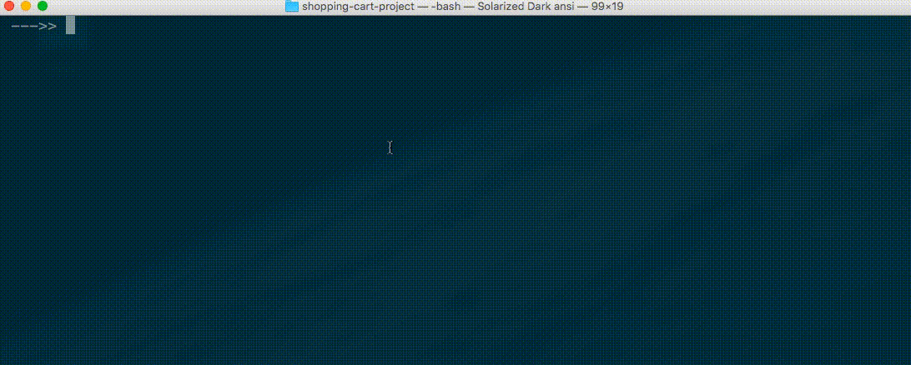
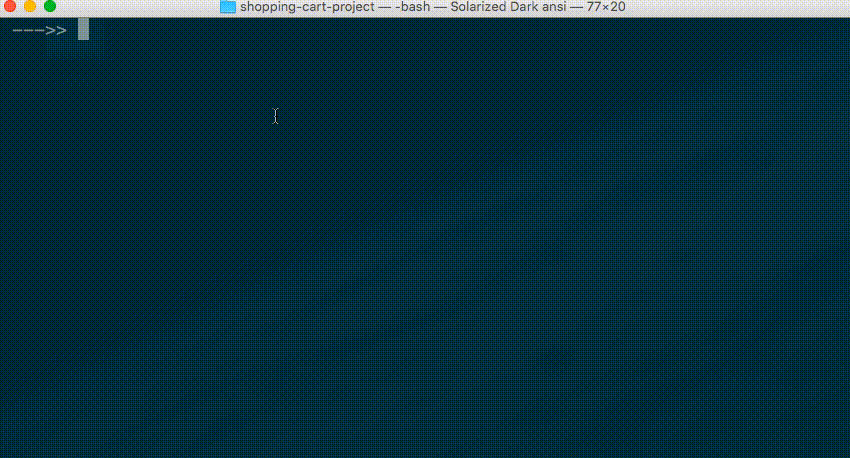
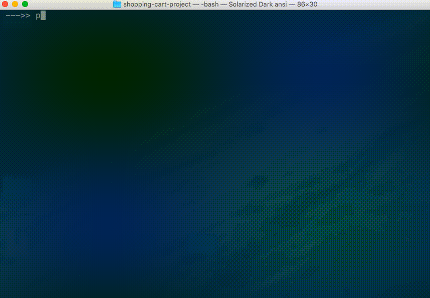

# Point-of-Sale App

## Checkpoints

First set-up a new local Git repository to contain this program (suggested), or choose the same repository you used for the "Groceries" project (acceptable).

Create a new file in your repository called `shopping_cart.py`, paste into it the list of products, then make your first commit.

When you successfully demonstrate your script's ability to perform one or more component pieces of desired functionality, commit your changes before moving on to the next step. Your history of commit messages might roughly resemble the checkpoint steps below.

#### Checkpoint I - User Inputs

The user input part of this project is probably the hardest part. This is because it represents something we "know we don't know" how to do. We should try to research and implement this part of the project as soon as possible to relieve our stress and to demonstrate to ourselves it can be done. If you'd rather do the easy parts first, skip this first checkpoint and come back to it after you finish the others.

Steps:

  1. Accept a user input value, store it in a variable, and print it. Hint: use the `input()` function.
  2. One at a time, iteratively accept a user input value, store it in a variable, and print it. Hint: use an infinite `while` loop. Note: you may have to press "control-c" to quit your script.
  3. One at a time, iteratively accept a user input value, store it in a variable, and print it. But stop the loop if the user inputs the word "DONE". Hint: use an `if` statement in conjunction with the `break` keyword.
  4. Repeat the previous step, but instead of printing each user input, store them all in a single list. Then print the list after the user is "DONE".

When you have finished this checkpoint, your program should perform like this:



#### Checkpoint II - Product Lookups

If you already did the first checkpoint, great job capturing and storing the user inputs! But now it's time to set that code aside. We will temporarily shift to an approach that uses a hard-coded list of product identifiers instead of the list of product identifiers which resulted from the user input process. We do this to speed-up the iteration cycle between our various development approaches, obviating our need to perform the user input process each time we want to test our program.

If you skipped the first checkpoint, you can start here using a list of hard-coded product identifiers.

At this time, your script might look something like this:

```python
products = [] #<--- that long list of dictionaries from above!

#
# some commented-out loop
# ... representing the result of the first checkpoint (if you did it)
# ... which accepts user inputs
# ... and prints the results
# ... and which we are temporarily ignoring
# ... (yours will actually be some working python code)
#

product_ids = [1, 8, 6, 16, 6] # temporary list of valid ids for testing purposes

print("SHOPPING CART ITEM IDENTIFIERS INCLUDE:", product_ids)

#TODO: perform product look-ups here!
```

Steps:

  1. For a single valid product identifier, look up the matching product and print its name and price. Hint: try using a custom function in conjunction with a list comprehension.
  1. For each valid product identifier in the example list, look up the matching product and print its name and price.
  1. For each valid product identifier in the example list, look up the matching product and print its name and price, and add its price to a running-total of all prices, then print the running-total after iterating through the entire list. For now, you don't necessarily need to worry about formatting prices as USD.

When you have finished this checkpoint, your program should perform something like this:



#### Checkpoint III - Receipt Printing

Steps:

  1. For each receipt component listed in the "Requirements" section above (e.g. store name, product prices, taxes, total price, farewell message, etc.), revise your program to print that component. Commit your code after implementing each component in the list.

When you have finished this checkpoint, your program should perform like this:



Once your program prints all required receipt components, it's time to stop using the hard-coded product identifiers. If you already did the first checkpoint, un-comment the code which performs the user input process, otherwise do the first checkpoint now. Afterwards, revise and configure the other parts of the program as necessary to use the list of product identifiers captured during the user input process.

Wow, you are finally done! Nice job. Now it's time to submit your work.
