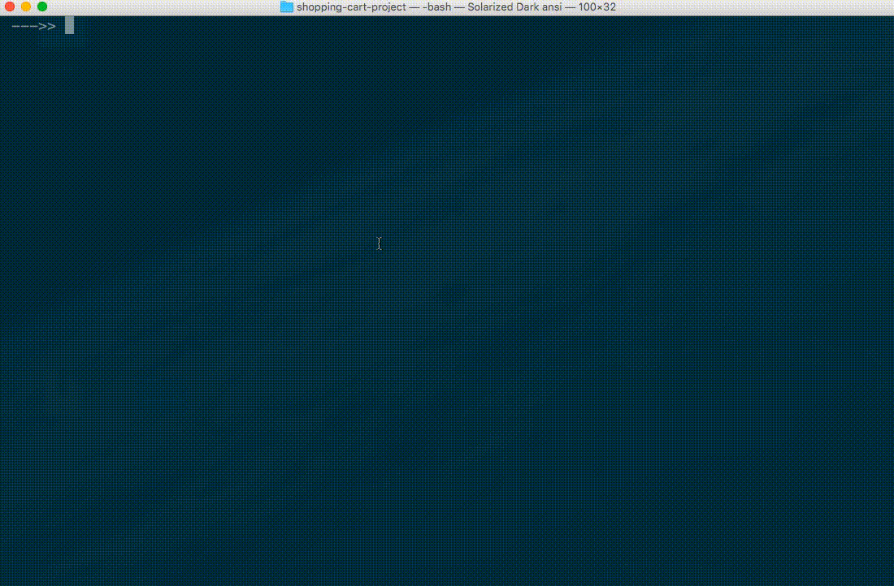

# Point-of-Sale App

Your local corner grocery store has hired you to help them modernize their checkout system.

Currently, the store affixes a price tag to each grocery item in stock. But the store owner wants to be able to change product prices at any given time. The store owner does not want to wait until all currently-priced items sell-out before being able to charge a different price for that type of item. And if there are any price tags that differ from prices charged at checkout, that would lead to confusion and a poor customer experience.

The store owner describes a desired checkout process which involves a checkout clerk scanning each item's barcode to look up its price. You agree using a barcode scanner would be a helpful process improvement. The store owner says the barcode scanners are somewhat expensive, so it would be ideal to test out the process before making a hardware purchase.

You offer to write a Python program that can run on the clerk's computer at the checkout counter. The program will look up the prices of items based on the unique identifier of each. You explain that the store can use this software to process the unique identifiers provided as a result of the barcode-scanning process, if the owner eventually decides to purchase the barcode scanners.

To provide the program with information inputs, you ask the store owner to maintain a list of currently-offered products and the current price of each. You also ask the store owner to mark each product with a unique identifier instead of a hard-coded price tag. You explain the identifier can be used to look up the price of any given item.

The store owner agrees! Now it's time to write software to mimic the barcode-scanning process.



## Instructions

Write a program that asks the user to input one or more product identifiers, then looks up the prices for each, then prints an itemized customer receipt including the total amount owed.

The program should use the following dictionary to represent the store owner's database of products and prices:

```py
products = [
    {"id":1, "name": "Chocolate Sandwich Cookies", "department": "snacks", "aisle": "cookies cakes", "price": 3.50},
    {"id":2, "name": "All-Seasons Salt", "department": "pantry", "aisle": "spices seasonings", "price": 4.99},
    {"id":3, "name": "Robust Golden Unsweetened Oolong Tea", "department": "beverages", "aisle": "tea", "price": 2.49},
    {"id":4, "name": "Smart Ones Classic Favorites Mini Rigatoni With Vodka Cream Sauce", "department": "frozen", "aisle": "frozen meals", "price": 6.99},
    {"id":5, "name": "Green Chile Anytime Sauce", "department": "pantry", "aisle": "marinades meat preparation", "price": 7.99},
    {"id":6, "name": "Dry Nose Oil", "department": "personal care", "aisle": "cold flu allergy", "price": 21.99},
    {"id":7, "name": "Pure Coconut Water With Orange", "department": "beverages", "aisle": "juice nectars", "price": 3.50},
    {"id":8, "name": "Cut Russet Potatoes Steam N' Mash", "department": "frozen", "aisle": "frozen produce", "price": 4.25},
    {"id":9, "name": "Light Strawberry Blueberry Yogurt", "department": "dairy eggs", "aisle": "yogurt", "price": 6.50},
    {"id":10, "name": "Sparkling Orange Juice & Prickly Pear Beverage", "department": "beverages", "aisle": "water seltzer sparkling water", "price": 2.99},
    {"id":11, "name": "Peach Mango Juice", "department": "beverages", "aisle": "refrigerated", "price": 1.99},
    {"id":12, "name": "Chocolate Fudge Layer Cake", "department": "frozen", "aisle": "frozen dessert", "price": 18.50},
    {"id":13, "name": "Saline Nasal Mist", "department": "personal care", "aisle": "cold flu allergy", "price": 16.00},
    {"id":14, "name": "Fresh Scent Dishwasher Cleaner", "department": "household", "aisle": "dish detergents", "price": 4.99},
    {"id":15, "name": "Overnight Diapers Size 6", "department": "babies", "aisle": "diapers wipes", "price": 25.50},
    {"id":16, "name": "Mint Chocolate Flavored Syrup", "department": "snacks", "aisle": "ice cream toppings", "price": 4.50},
    {"id":17, "name": "Rendered Duck Fat", "department": "meat seafood", "aisle": "poultry counter", "price": 9.99},
    {"id":18, "name": "Pizza for One Suprema Frozen Pizza", "department": "frozen", "aisle": "frozen pizza", "price": 12.50},
    {"id":19, "name": "Gluten Free Quinoa Three Cheese & Mushroom Blend", "department": "dry goods pasta", "aisle": "grains rice dried goods", "price": 3.99},
    {"id":20, "name": "Pomegranate Cranberry & Aloe Vera Enrich Drink", "department": "beverages", "aisle": "juice nectars", "price": 4.25}
] # based on data from Instacart: https://www.instacart.com/datasets/grocery-shopping-2017
```

### Requirements

The program should prompt the checkout clerk to input the identifier of each shopping cart item, one at a time. At any time the clerk should be able to indicate there are no more shopping cart items by inputting the word `DONE`.

After the clerk indicates there are no more items, the program should print a custom receipt on the screen. The receipt should include the following components:

  + A grocery store name of your choice.
  + A grocery store phone number and/or website URL and/or address of choice.
  + The date and time of the beginning of the checkout process, formatted in a human-friendly way.
  + The name and price of each shopping cart item, price being formatted as US dollars and cents (e.g. `$1.50`), optionally sorted alphabetically by name, optionally grouped by department and displayed underneath the respective department name.
  + The total cost of all shopping cart items, formatted as US dollars and cents (e.g. `$1.50`), calculated as the sum of their prices.
  + The amount of tax owed, calculated by multiplying the total cost by a New York City sales tax rate of `0.08875`.
  + The total amount owed, formatted as US dollars and cents (e.g. `$1.63`), calculated by adding together the amount of tax owed plus the total cost of all shopping cart items.
  + A friendly message thanking the customer and/or encouraging the customer to shop again.

The program should be able to process multiple shopping cart items of the same type, but does not need to display any groupings or aggregations of those items.

### Setup

Create a new directory on your Desktop called "point-of-sale-app", then navigate there from the command-line.

Within that directory, create a new file called `shopping_cart.py` and place inside the following code:

```python
# shopping_cart.py

products = [
    {"id":1, "name": "Chocolate Sandwich Cookies", "department": "snacks", "aisle": "cookies cakes", "price": 3.50},
    {"id":2, "name": "All-Seasons Salt", "department": "pantry", "aisle": "spices seasonings", "price": 4.99},
    {"id":3, "name": "Robust Golden Unsweetened Oolong Tea", "department": "beverages", "aisle": "tea", "price": 2.49},
    {"id":4, "name": "Smart Ones Classic Favorites Mini Rigatoni With Vodka Cream Sauce", "department": "frozen", "aisle": "frozen meals", "price": 6.99},
    {"id":5, "name": "Green Chile Anytime Sauce", "department": "pantry", "aisle": "marinades meat preparation", "price": 7.99},
    {"id":6, "name": "Dry Nose Oil", "department": "personal care", "aisle": "cold flu allergy", "price": 21.99},
    {"id":7, "name": "Pure Coconut Water With Orange", "department": "beverages", "aisle": "juice nectars", "price": 3.50},
    {"id":8, "name": "Cut Russet Potatoes Steam N' Mash", "department": "frozen", "aisle": "frozen produce", "price": 4.25},
    {"id":9, "name": "Light Strawberry Blueberry Yogurt", "department": "dairy eggs", "aisle": "yogurt", "price": 6.50},
    {"id":10, "name": "Sparkling Orange Juice & Prickly Pear Beverage", "department": "beverages", "aisle": "water seltzer sparkling water", "price": 2.99},
    {"id":11, "name": "Peach Mango Juice", "department": "beverages", "aisle": "refrigerated", "price": 1.99},
    {"id":12, "name": "Chocolate Fudge Layer Cake", "department": "frozen", "aisle": "frozen dessert", "price": 18.50},
    {"id":13, "name": "Saline Nasal Mist", "department": "personal care", "aisle": "cold flu allergy", "price": 16.00},
    {"id":14, "name": "Fresh Scent Dishwasher Cleaner", "department": "household", "aisle": "dish detergents", "price": 4.99},
    {"id":15, "name": "Overnight Diapers Size 6", "department": "babies", "aisle": "diapers wipes", "price": 25.50},
    {"id":16, "name": "Mint Chocolate Flavored Syrup", "department": "snacks", "aisle": "ice cream toppings", "price": 4.50},
    {"id":17, "name": "Rendered Duck Fat", "department": "meat seafood", "aisle": "poultry counter", "price": 9.99},
    {"id":18, "name": "Pizza for One Suprema Frozen Pizza", "department": "frozen", "aisle": "frozen pizza", "price": 12.50},
    {"id":19, "name": "Gluten Free Quinoa Three Cheese & Mushroom Blend", "department": "dry goods pasta", "aisle": "grains rice dried goods", "price": 3.99},
    {"id":20, "name": "Pomegranate Cranberry & Aloe Vera Enrich Drink", "department": "beverages", "aisle": "juice nectars", "price": 4.25}
] # based on data from Instacart: https://www.instacart.com/datasets/grocery-shopping-2017

print(products)

# TODO: write some Python code here to produce the desired functionality
```

Run the script to see it print the list of products:

```sh
# For Homebrew-installed Python 3.x on Mac OS:
python3 shopping_cart.py

# All others:
python shopping_cart.py
```

Great, now you are ready to start the exercise.

If you need help or inspiration, see the [Checkpoints](checkpoints.md) document for a step-by-step guided walk-through. Also consider following along with these Screencasts ([Part 1](https://youtu.be/avC4xbZx-No), [Part 2](https://youtu.be/Vl8AiW9iukQ)) which depict one possible solution.

If you are moving through this project with ease, consider addressing one or more of the [Further Exploration](further.md) challenges, but only after you have finished the core required functionality.


## Submission Instructions

By this time, students should be able to replicate the submission instructions for previous exercises, also abbreviated below.

### Step 1 - Creating a new Project Repo

Use the GitHub.com online interface to create a new GitHub repository under your control
named something like "point-of-sale-app".
When you create a new repository, in order to easily use the GitHub.com online interface to manage files,
check the box to **Initialize this repository with a README**.
Once the repository is created, add a file to it called `shopping_cart.py`.
Paste your Python script into that file, then save and commit it.
At this time you should be able to view your instructions online at your project repository's URL.

### Step 2 - Forking the Course Repo

If you have not yet already forked the course repository, do so now.

Otherwise, if you have already forked the course repository
(i.e. if you have already submitted a previous exercise),
then you will need to update your existing fork instead.

### Step 3 - Submitting a Pull Request

Add a new record to the [submissions file](submissions.csv),
to include your GitHub username and the repository's URL (e.g. `https://github.com/YOUR_USERNAME/point-of-sale-app`).
After updating your own fork, you will need to submit a Pull Request
for your content to be accepted into the main course repository.


## Evaluation

Extra credit for presence of a Python program which runs without error and produces the desired functionality, in addition to the functionality described in the "further exploration" challenges: "validating user inputs" and/or "writing receipts to file".

Full credit for presence of a Python program which runs without error and produces the desired basic functionality.

Else half credit for presence of a Python program which doesn't run or doesn't exactly produce the desired functionality.

Else no credit.

> UPDATED RUBRIC:
>
> Category | Weight
> --- | ---
> Info Inputs (Identifiers and "DONE")| 20%
> Info Outputs (Store Name and Contact) | 20%
> Info Outputs (Date and Time) | 20%
> Info Outputs (Products and Prices) | 20%
> Info Outputs (Tax and Totals) | 20%
